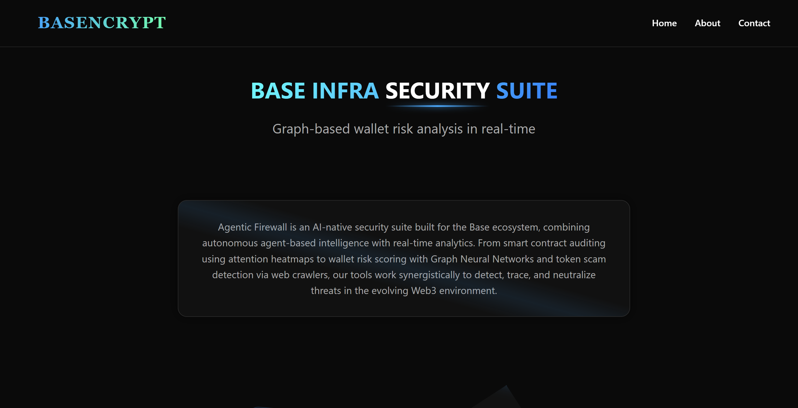

# BASEncrypt
## 🔥 FIREWALL OF BASE — Your AI-Powered Blockchain Guardian !

> **"What antivirus is to PCs, Firewall of Base is to your crypto wallet."**  
> An AI-powered, real-time defense system that **validates**, **monitors**, and **protects** your wallet on the **Base blockchain** — with intelligent agents, lightning-fast inference, and forensic deep research capabilities.

---

## 🛡️ Why Firewall of Base?

Smart contracts are immutable — but that doesn't mean they're trustworthy.  
Scammers, faulty tokens, and malicious actors are one click away from draining your assets.

We built **Firewall of Base** to make sure that never happens.

---

## 🚀 What Makes It Different?

| Feature | Traditional Wallets | **Firewall of Base** |
|--------|---------------------|----------------------|
| Smart Contract Trust | ✅ Implicit (blind trust) | ✅ Validated with AI agents |
| Transaction Monitoring | ❌ None | ✅ Real-time inference |
| Deep Threat Tracing | ❌ Not available | ✅ Recursive AI-based backtracking |
| Wallet Health Monitoring | ❌ Manual | ✅ Heartbeat-based check-ins |
| Suspicious Address Flagging | ❌ Community-driven | ✅ Auto-flagging + Legal-ready logs |
| Refundability Analysis | ❌ Not possible | ✅ Checked during research |
| Real-time Inference | ❌ Server-bound | ✅ CPU-level millisecond inference |

---

## ⚙️ Key Features

### 🔐 Volatility-Free Transactions
- No more blind signing.
- Validate **wallets** and **token addresses** with server-side intelligent agents.

### ⚡ Blazing-Fast CPU Inference
- Trained **attention-based models** enable decision-making in **milliseconds** — on device, no server round-trips.

### 🔍 Deep Research Mode
- Recursive investigation of any suspicious activity.
- Reveals the **entire flow** of currency (including intermediaries).
- Flags all connected addresses and reveals origin of the threat.

### 📡 Heartbeat Monitoring System
- A non-blocking **heartbeat daemon** constantly monitors your wallet.
- Detects malicious behavior the moment it starts — not after it's too late.
- Triggers **instant notifications** and optionally runs **deep research**.

### 🚨 Real-Time Threat Alerts
- Users are **instantly alerted** on detection of suspicious behavior.
- Option to **approve**, **halt**, or run **investigative tracing**.

### 🔁 Auto Flag + Legal Logging
- Malicious addresses are auto-flagged.
- Research reports can be **shared with legal authorities** or integrated into trust layers (like allowlists/blacklists).

---

## 🧠 Architecture Overview

```mermaid
flowchart TD
    U[👤 User Wallet] -->|Interaction| A[⚙️ Agent Validator]
    A -->|Valid| TX[📤 Transaction Execution]
    A -->|Invalid| H[🚨 Heartbeat Triggered]
    H -->|Optional| D[🔍 Deep Research Engine]
    D --> F[📈 Flow Reconstruction + Flagging]
    F --> L[📬 Notify User + Legal Logs]
````

---

## 🌐 Why We Built It for BASE

The **Base ecosystem** is fast, scalable, and committed to making **on-chain the next online** — but:

> 💬 "Speed needs security. Scale needs trust."

By building directly on **Base**, we ensure:

* **Native integration** with on-chain contracts and dApps.
* Optimized execution within **OP Stack** constraints.
* Alignment with **Base’s vision of accessible and secure web3**.

---

## 🔧 Technologies & Stack

* **Attention Models** – Trained for token/wallet pattern detection
* **FastAPI** – Backend brain and agent controller
* **LangChain Agents** – Recursive research system
* **CPU Inference Engine** – Blazing-fast real-time inference
* **Heartbeat Daemon** – Async, non-blocking wallet monitor
* **MongoDB/Postgres** – Flag and flow storage
* **Mermaid, React, Tailwind** – For elegant UI & flow visualizations

---

### 🧠 Deep Research Flow — Website Look
Recursive trace visualization of malicious transaction flow, intermediaries, and refundability checks.

 

---

## ✨ Future Roadmap

* [ ] AI-generated contract safety scores
* [ ] Integration with dApp-level whitelists
* [ ] Social trust signals (e.g., friends warned too)
* [ ] Privacy-preserving on-device models

---

> **"Before your funds move, let your firewall think."**
> Secure your Base. Protect your future.
> — *Firewall of Base*
